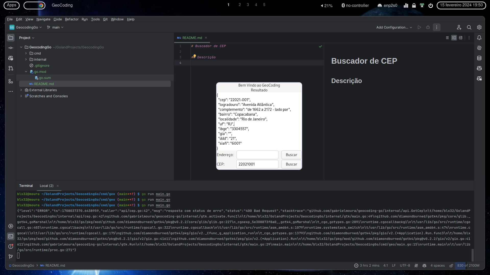
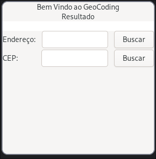
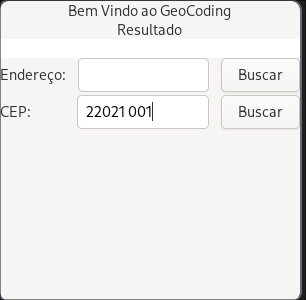
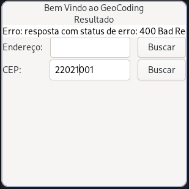
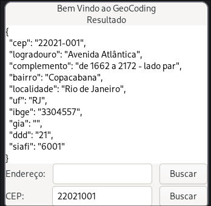

# Buscador de CEP

## Descrição
Integração com GTK 4 para buscar CEP e exibir os dados do endereço. Também é possível buscar a latitude e longitude do endereço, passando o nome da rua e a cidade.

## Tecnologias
- GTK 4
- Go 1.22
- [Cambalache](https://flathub.org/apps/ar.xjuan.Cambalache)
- [Embed](https://pkg.go.dev/embed)

## Captura de tela

